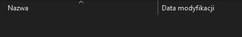
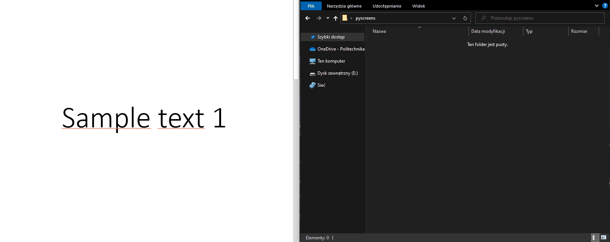

# Screen-o-bot

Screen-o-bot is a Python script that automates taking screnshots,
taking them only when screen changes.

## Dependencies

Currently screen-o-bot requires:

- [Python 3.4 or newer](https://www.python.org/)
- [pyautogui](https://pyautogui.readthedocs.io/en/latest/)
- [Pillow](https://pypi.org/project/Pillow/)
- [OpenCV for Python](https://pypi.org/project/opencv-python/)

Use the package manager [pip](https://pip.pypa.io/en/stable/) to install dependencies.

```bash
pip install pyautogui pillow opencv-python
```

## Usage

1. Run script


2. Folder named 'pyscreens' will be created on your Desktop


3. Inside this folder, a directory with current date and time will be created



4. Inside this directory, screens will be created whenever a given area of the screen will change its state



## Contributing
Pull requests are welcome. For major changes, please open an issue first to discuss what you would like to change.

## Disclaimer

Always make sure that you **are allowed** to take the screenshot of your
screen content.

Creator of this script is not responsible in any way for script's use or misuse.

This script is a work-in-progress. It may not work as intended.
Currently script takes screenshot of left side of the main monitor.
It is possible to change by modifying region properties in:

```bash
myscreenshot = gui.screenshot(region=(5, 5, 900, 880))
```
For more information, check [official pyautogui documentation](https://pyautogui.readthedocs.io/en/latest/screenshot.html).

This method is not by any means perfect. Perhaps some elegant solution will be implemented.

## License
[MIT](https://choosealicense.com/licenses/mit/)

